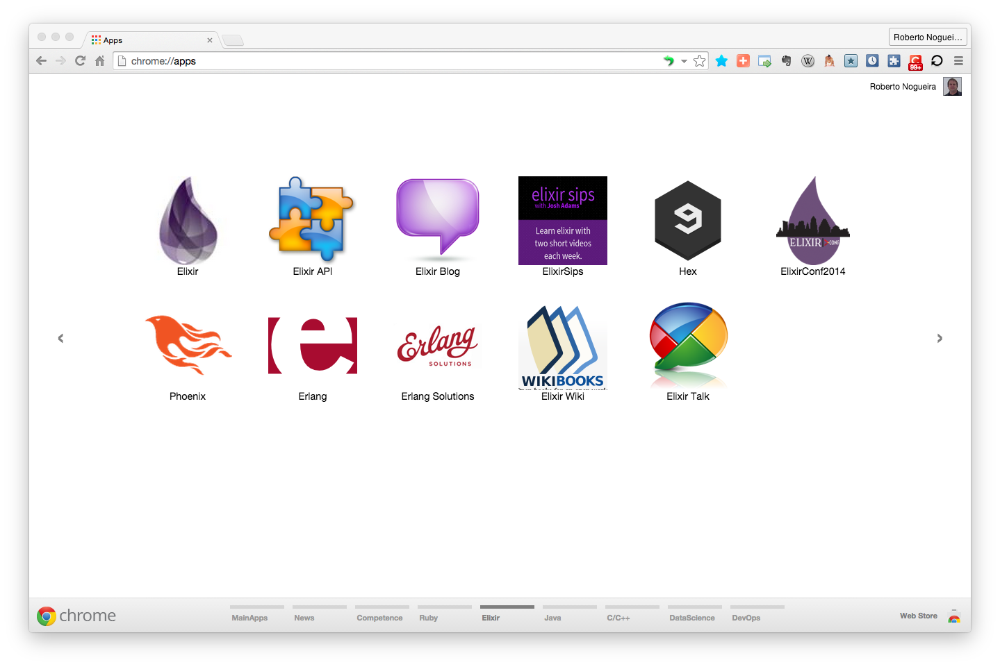

# Chrome Apps for Elixir


* In order to load the `Chrome Apps` for Elixir open the following url:

```
chrome://extensions/
```

* And then check `Developer Mode`.

* Press `Load unpacked extension...` load each App selecting its corresponding diretory e.g. `Elixir-Blog`.

* After load all the `Chrome Apps` for Elixir, Chrome will look like the screenshot below:

