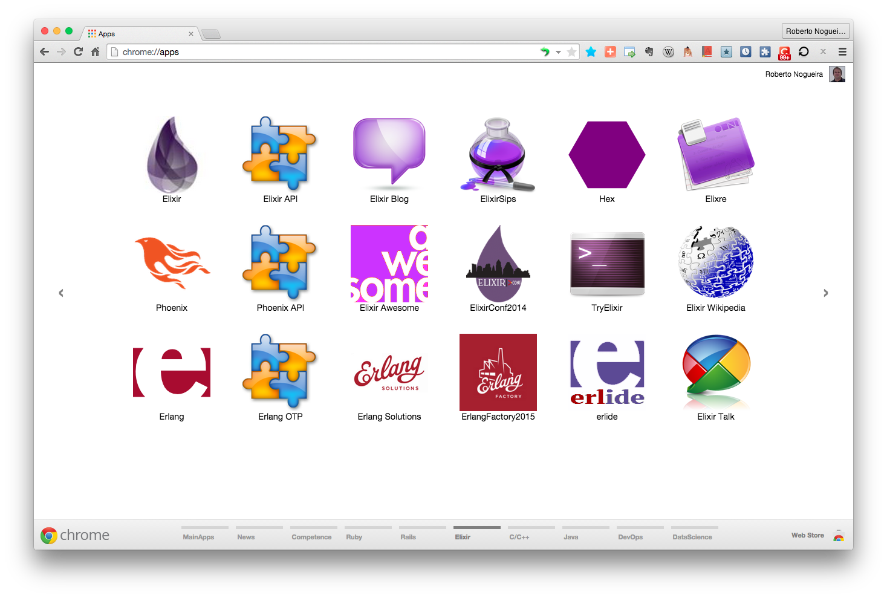

# Chrome Apps for Elixir


## Installation

### 1. Clone this repository and see its contents.
Open a terminal give the following command:

```bash
$ git clone https://github.com/enogrob/ChromeApps_Elixir.git
```

As we can see a subdirectory is created for each Elixir app.

```bash
$ ls -la
total 40
drwxr-xr-x@   9 enogrob  staff   306B Mar 23 08:15 ./
drwxr-xr-x+ 127 enogrob  staff   4.2K Mar 22 13:32 ../
:
drwxr-xr-x   18 enogrob  staff   612B Mar 23 08:12 ChromeApps_Elixir/

$ tree -L 1 ChromeApps_Elixir/
ChromeApps_Elixir/
├── Elixir-Awesome
├── Elixir-Blog
├── Elixir-Conf2014
├── Elixir-ElixirAPI
├── Elixir-ElixirWikipedia
├── Elixir-Elixre
├── Elixir-Erlang
├── Elixir-ErlangOTP
├── Elixir-ErlangSolutions
├── Elixir-Exrm
├── Elixir-GoogleGroups
├── Elixir-Hex
├── Elixir-Homepage
├── Elixir-Phoenix
├── Elixir-PhoenixAPI
├── Elixir-Sips
├── Elixir-TryElixir
├── Elixir-Wiki
├── Elixir-erlide
├── README.md
└── images

20 directories, 1 file
$
```

### 2. Open Chrome with the following url:
In order to load the `Chrome Apps` for Elixir, check `Developer Mode` and press `Load unpacked extension...` to load each App selecting its corresponding directory inside `ChromeApps_Elixir` e.g. `Elixir-Blog`, and then repeat that for the other apps.

```
chrome://extensions/
```


### 3. After load all the Chrome Apps for Elixir, Chrome will look like the screenshot below:

